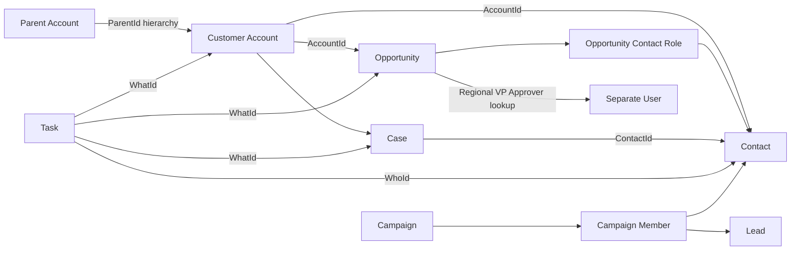
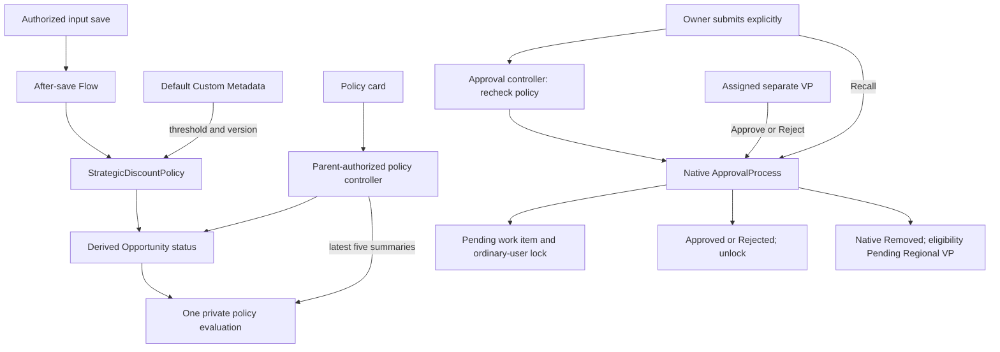
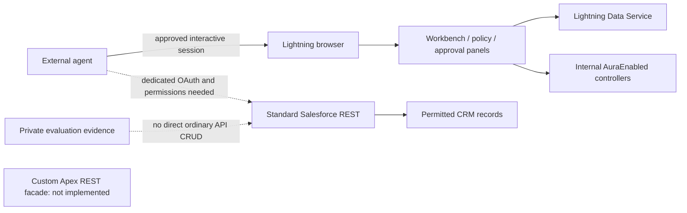

# Application knowledge graph

The full [machine-readable graph](../knowledge/application-graph.json) contains typed nodes and directed, source-attributed edges for metadata, permissions, components, tests, datasets, 368 logical fixtures and ten manual scenarios. These compact views show its main relationships; the JSON has the field-level detail. Nothing in the graph grants an agent permission to execute an action.

## Business record relationships



Arrows here emphasize business relationships, not cardinality constraints. A Campaign Member links one Contact OR Lead. Task references are polymorphic. The fixture graph uses logical keys such as `fixture:A05` and `fixture:O02`, never deployed record IDs or credentials.

## Policy and human approval



Policy eligibility is not an approval request. Human decisions change the derived status through native field updates but do not append policy-input evaluations. Relevant input changes evaluate again; unrelated Stage/Name changes do not. Admin overrides remain outside the app's restrictive action adapter.

## Agent access boundaries



Dashed edges describe limitations/prerequisites, not active access grants. The UI's narrow private-history reader is not an external API. The current integration permission set grants Opportunity input operations and Account read only, not all seeded modules. Read the [agent guide](agent-integration-guide.md) before designing connectors or API tests.

## Graph schema and traversal

Top level: `schemaVersion`, `apiVersion`, `sourceSnapshot`, `provenance`, `authorization`, `nodes`, `edges`.

- Node: stable `id`, `kind`, human `label`, source path and type-specific attributes. Kinds include object, field, apex-class, apex-test, flow, permission-set, approval-process, workflow-field-update, lightning-component/page/app, capability, dataset, synthetic-fixture, manual-use-case and file.
- Edge: stable `id`, `from`, `relation`, `to`, `source`, optional relationship details. Examples: `has_field`, `references`, `reads`, `writes`, `calls`, `appends`, `routes_via`, `tests`, `object_grant`, `field_grant`, `contains`.
- File paths and edge provenance use repository-relative paths. Static fields parsed from custom XML include type, label, requiredness, precision/scale and picklist values. Standard fields referenced by fixtures require runtime describe for complete schema/permissions.
- Permission edges describe additive source grants, not a user's complete effective access. Historical evidence is not treated as current runtime authority.
- `sourceSnapshot` fingerprints the repository candidates excluding generated graph/index outputs, using UTF-8 text normalized to LF. No timestamps or machine-specific paths are included, making regeneration deterministic across checkouts.

Useful traversals: policy configuration → pure policy → Flow/output/evidence → UI/tests; Opportunity field → field grants; manual case → modules/dataset → fixture references; approval process → routing lookup → User and native request history. For an impact-analysis decision, read the connected source and obtain current runtime evidence; the graph does not model every possible standard Salesforce dependency.

## Regenerate and validate

```powershell
npm run catalog:build
npm run catalog:check
npm run catalog:test
```

Run inside the Salesforce project. The generator uses only Node built-ins and Git's tracked/unignored file inventory; it does not query Salesforce or emit auth state. Tests reject duplicate/dangling graph IDs, missing sources, missing scenarios, incorrect core policy facts and common auth/secret artifacts in publish candidates. It is a focused safety check, not a guarantee that every possible secret format is detected.
